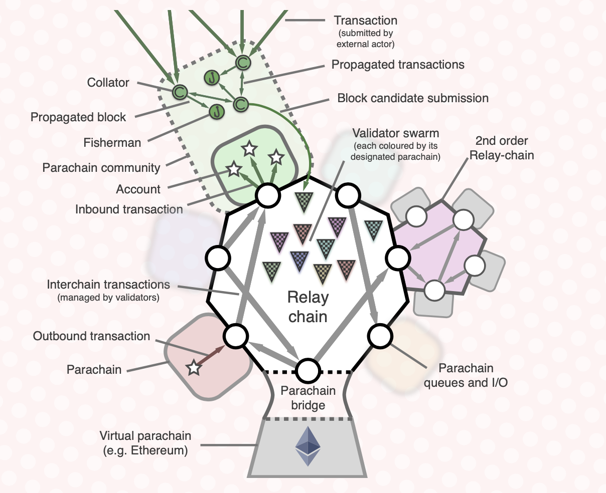

# learn polkadot

## [substrate tutorial](https://docs.substrate.io/tutorials/v3/)

## [Develop and Deploy your first smart contract on Astar/Shiden EVM](https://docs.astar.network/tutorial/develop-and-deploy-your-first-smart-contract-on-aster-shiden-evm)

- <https://github.com/PlasmNetwork/Astar>

## White Paper 要約

## 1

- Polkadot が解決する問題
  - スケーラビリティ
    - 1 つのトランザクションを処理するために、システムが処理、帯域、ストレージにどれだけのリソースをグローバルに費やしているか
    - 典型的な条件下でどれだけの数のトランザクションを合理的に処理できるか
  - 分離性
    - 複数の関係者やアプリケーションの分割ニーズに、同一のフレームワークでほぼ最適に対応できるか。
- Ethreum
  - 1 秒間に 30 トランザクション程度が限界
  - PoS でも同じ
- スケーラビリティ問題の解決策
  - コンセンサスアーキテクチャと状態遷移メカニズムを切り離す
- これまでのブロックチェーン実装
  - 一般的なアプリケーションに対して、地理的に優れた単一のチェーンを提供することに重点が置かれていた
  - Polkadot 自体は、固有のアプリケーション機能を一切提供しないように設計

## 2

- Polkadot committee
  - ユーザーの開発ニーズと開発者の正当性ニーズを反映させるため 2 つの委員会
    - 「ユーザー」委員会（ボンド validator ーで構成）
    - 「技術」委員会（主要なクライアント開発者とエコシステムプレーヤーで構成）
- Polkadot の基本理念、デザイン決定を評価ルール
  - 最小限
    - Polkadot はできるだけ機能的でないものでなければならない。
  - シンプル
    - 基本プロトコルには、ミドルウェアにオフロードできる範囲を超えた複雑さがあってはなりません。
      - ミドルウェアにオフロードしたり、パラチェーンを介して配置したり、後の最適化で導入したりすることが合理的である以上の複雑さが基本プロトコルに存在してはならない。
    - 一般：パラチェーンに不必要な要求、制約、制限を設けるべきではない
      - Polkadot は合意形成のためのテストベッドであり、拡張機能が適合するモデルを可能な限り縮小することで最適化することができる。
    - ポルカドットはコンセンサスシステム開発のテストベッドであるべきである。
      - テストベッド: 新技術の実証試験に使用されるプラットフォーム
    - 堅牢であること
      - 基本的に安定したベースレイヤーを提供すること。
      - 経済的に安定していることに加えて、高額な報酬を得ることができる攻撃の手段を最小限に抑えるために分散化することも意味している
- Polkadot の哲学

  - 役割は 4 つ
    - collator
      - validator が有効なパラチェーンブロックを生成するのを支援する
      - 既存の PoW ブロックチェーンでマイナーが行うのと同じように、新しいブロックを作成したり、トランザクションを実行したりするために必要な情報をすべて保持
      - 取引を照合・実行して封印されていないブロックを作成し、そのブロックをゼロ知識証明とともに、パラチェーンブロックの提案を担当する validator に提供する
    - fisherman
      - 少なくとも 1 つの被結合者が違法行為を行ったことをタイムリーに証明することで報酬を得る
      - 悪さをしている validator を発見することで高額の報酬を得ることができる
    - nominator
      - リスクキャピタルを預ける以外に追加の役割はない
      - 特定の validator(またはその集合)がネットワークの保守に責任を持って行動することを信頼していることを示す
    - validator
      - 最高額の課金者
      - Polkadot ネットワーク上の新しいブロックを封印する手助けをする
      - ステーキングをした他の nominator が 1 人または複数の validator を指名して代理を務めることができる
      - そのため validator のステーキングボンドの一部は必ずしも validator 自身が所有するのではなく、これらの指名者が所有することになる
      - validator が全てのパラチェーンの完全に同期したデータベースを維持することは 合理的に期待できない
      - 案された新しいパラチェーンブロックを作成するタスクを collator に依頼する

- デザイン
  - 
  - modern asynchronous Byzantine fault-tolerant (BFT) algorithm
  - PoS で validator を決定する
  - validator は Nominated Proof-of-Stake (NPoS)方式で、不定期に(多くても 1 日 1 回、少なくても四半期に 1 回)選出される
  - 報酬は、トークンベースの拡大による資金の比例配分（年間最大 100％だが、10％程度の可能性もある）と、徴収した取引手数料によって得ることができる
  - Parachain で実行されたトランザクションは、第 2 の Parachain、あるいは潜在的にはリレーチェーンへのトランザクションのディスパッチを行うことができる
  - チェーン間トランザクションは、標準的な外部署名付きトランザクションと事実上区別できない
  - インターチェーン取引には、何らかの手数料の「支払い」が伴うことはない
- Polkadot と Ethereum
  - Ethereum の完全性を考慮すると、Polkadot と Ethereum は、少なくとも簡単に推論できる安全性の範囲内で、お互いに相互運用できる十分な機会がある
  - Polkadot からのトランザクションは validator によって署名され、Ethereum に送り込まれて、トランザクション転送コントラクトによって解釈され、実行されることを想定している
  - Ethreum からのトランザクションはイベントを利用することで、特定のメッセージが転送されるべきかどうかを迅速に確認することができるようになる
    - break-out contract と呼ばれるコントラクトを実行する
    - このコントラクトはイベントを発行する
    - トランザクションの正当性は取り込まれたブロックの深さが 120 に到達することで保つ
- Polkadot と Bitcoin
  - Ethreum と同じような形で実現
  - しかし、合理的で安全なビットコインの相互運用性を持つ仮想パラチェーンを置くことは非現実的ではない
